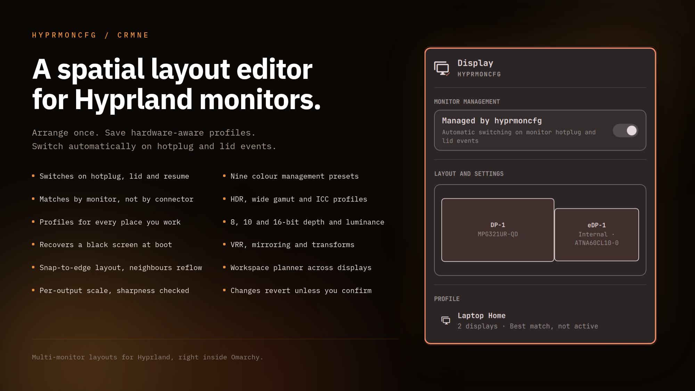

# hyprmoncfg: Multi-Monitor Manager for Omarchy

An Omarchy bar panel for [hyprmoncfg](https://hyprmoncfg.dev/). Create multi-monitor layouts for Hyprland in a visual editor and switch them automatically on hotplug and lid events. See the live display layout and active profile in the bar, or hand display management cleanly back to Omarchy.



The panel is intentionally the full hyprmoncfg experience: it installs the stable AUR package, enables the user daemon, and uses automatic switching on monitor hotplug.

## Install

```sh
omarchy plugin add https://github.com/crmne/omarchy-hyprmoncfg.git --enable
```

If hyprmoncfg is missing, open the panel and choose **Install hyprmoncfg**. Omarchy opens its normal presented terminal and runs:

```sh
omarchy pkg aur add hyprmoncfg && systemctl --user enable hyprmoncfgd.service && systemctl --user restart hyprmoncfgd.service && setsid -f gtk-launch hyprmoncfg-omarchy >/dev/null 2>&1
```

The installer explicitly restarts the daemon after installing or updating the package, so an already-running service immediately uses the new binary. It then opens hyprmoncfg through its hidden Omarchy desktop launcher. That launcher ships with the main package and carries Omarchy's standard `TUI.float` window identity, so the editor opens centered at the normal floating size without putting Omarchy-specific window logic in the panel. Saving a profile updates the panel immediately over IPC. The plugin never runs `yay` or requests privileges invisibly inside `omarchy-shell`.

## Requirements

- Omarchy Quattro with third-party shell plugins
- hyprmoncfg 1.12.0 or newer (installed from the panel when missing)

## Staying up to date

Omarchy installs plugins as git checkouts and never pulls them, so this one checks for itself. When the checkout is behind its origin, the panel offers **Update this panel**, which runs `omarchy plugin update crmne.hyprmoncfg`. The check happens when you open the panel, at most once every few hours, and stays quiet when the checkout has no remote or the remote cannot be reached.

Upgrading the hyprmoncfg package is a separate matter: installing runs as root and cannot restart a user service, so the previous daemon keeps serving profiles until someone restarts it. When the running daemon is older than the installed binary, the panel offers **Restart daemon**. The hyprmoncfg TUI says the same in its status line, where the message is also the button.

## Remove

```sh
omarchy plugin remove crmne.hyprmoncfg
```

Removing the plugin leaves hyprmoncfg and its saved profiles in place. To stop automatic switching first, turn off **Managed by hyprmoncfg** in the panel. Remove the AUR package separately only if you no longer use hyprmoncfg.

## Development

```sh
omarchy plugin validate .
node --test tests/model.test.js
```
